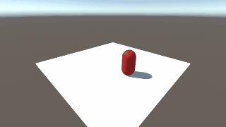

# Devlog for DevLogger Version 0.1.2

## Wednesday 4 March 2020, 22:08

test

[This DevLog entry was Tweeted.]

## Wednesday 4 March 2020, 22:08

test

[This DevLog entry was Tweeted.]

## Friday 6 March 2020, 23:43

Testing sending of 280 character tweet. Testing sending of 280 character tweet. Testing sending of 280 character tweet. Testing sending of 280 character tweet. Testing sending of 280 character tweet. Testing sending of 280 character tweet. Testing sen

[This DevLog entry was Tweeted.]

## Friday 3 July 2020, 21:42

DevLogger is an open source tool to make it easy to keep a devlog in Unity. Never leave the editor. Grab screenshots of the game and the editor. Post them to a Dev Log, post them to Twitter. Never leave Unity.

